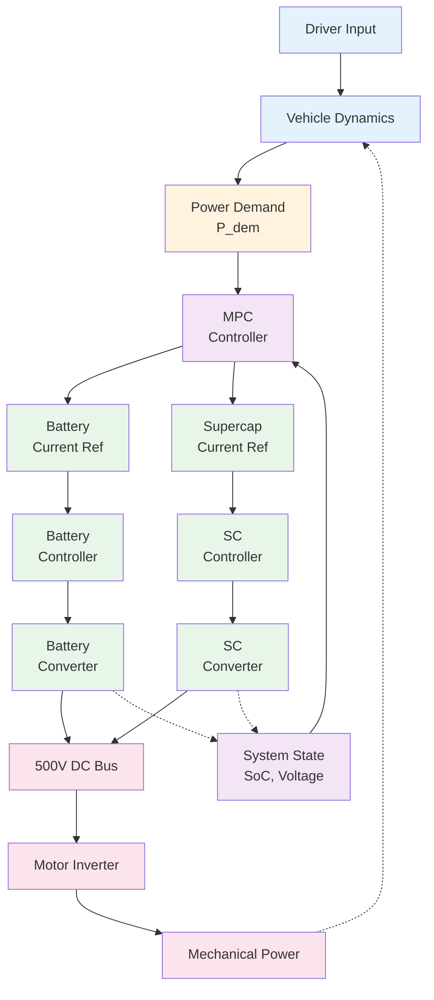

# Energy Management System Architecture

## System Overview

## Architecture Layers

### 📊 Layer 1: Perception (Input)
- Receive driver commands
- Calculate vehicle dynamics
- Determine power demand

### 🎯 Layer 2: Decision (Optimization)
- **MPC Controller**: Decides optimal energy distribution between battery and supercapacitor
- Monitors system state (SoC, voltage)
- Calculates reference current for each source

### ⚡ Layer 3: Control (Execution)
- PI controllers track reference currents
- DC/DC converters transform power
- Operates at 20 kHz (fast response)

### 🔋 Layer 4: Power (Physical)
- Battery and supercapacitor combine
- 500V DC bus delivers power to motor inverter
- Motor converts electrical to mechanical power

## Operation Flow

1. **Input** → Driver presses pedal, power demand is determined
2. **Decision** → MPC calculates optimal distribution
3. **Control** → Controllers adjust currents to targets
4. **Output** → Motor produces mechanical power
5. **Feedback** → System state updates (dashed lines)

## Key Features

| Feature | Description |
|---------|-------------|
| **Power Sources** | Battery + Supercapacitor |
| **Power Bus** | 500V DC |
| **Control Frequency** | 20 kHz |
| **Control Method** | Model Predictive Control (MPC) |
| **Feedback** | SoC, Voltage, Torque |
