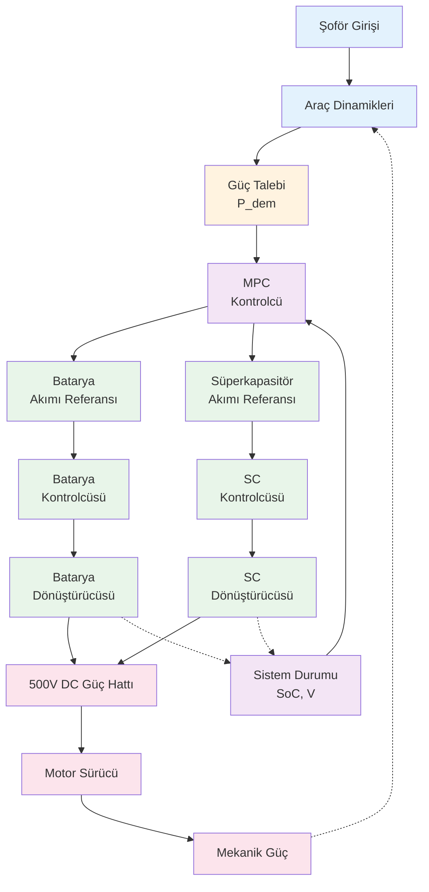

# Enerji Yönetim Sistemi Mimarisi

## Sistem Genel Bakış

## Katmanlar Nedir?

### 📊 1. Algılama Katmanı (Giriş)
- Şoför komutları alınır
- Araç dinamikleri hesaplanır
- Güç talebi belirlenir

### 🎯 2. Karar Katmanı (Optimizasyon)
- **MPC**: Batarya ve süperkapasitör arasında optimal enerji dağılımını belirler
- Sistem durumunu (SoC, gerilim) takip eder
- Her bir kaynağın referans akımını hesaplar

### ⚡ 3. Kontrol Katmanı (Uygulanış)
- PI kontrolcüler referans akımları takip eder
- DC/DC dönüştürücüler güçü dönüştürür
- 20 kHz frekansında çalışır (hızlı yanıt)

### 🔋 4. Güç Katmanı (Fiziksel)
- Batarya ve süperkapasitör birleştirilir
- 500V DC hattı üzerinden motor sürücüsüne güç verilir
- Motor mekanik güce dönüştürür

## İşleyiş Akışı

1. **Giriş** → Şoför pedal basar, güç talebi belirlenir
2. **Karar** → MPC optimal dağılımı hesaplar
3. **Kontrol** → Kontrolcüler hedef akımları ayarlar
4. **Çıkış** → Motor güç üretir
5. **Geri Bildirim** → Sistem durumu güncellenir (kesikli çizgiler)

## Temel Özellikler

| Özellik | Açıklama |
|---------|----------|
| **Kaynaklar** | Batarya + Süperkapasitör |
| **Güç Hattı** | 500V DC |
| **Kontrol Hızı** | 20 kHz |
| **Yöntem** | Model Öngörülü Kontrol (MPC) |
