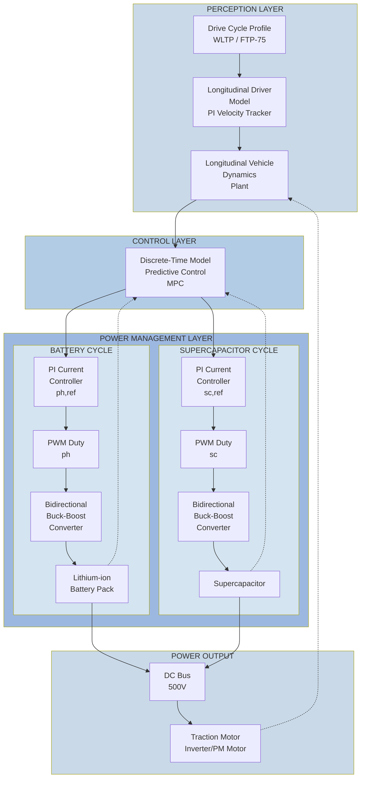

# Energy Management System Architecture

## System Overview

## Architecture Layers

### 📋 Layer 1: Perception (Input)
- **Drive Cycle Profile**: Defines the driving scenario (WLTP, FTP-75)
- **Longitudinal Driver Model**: PI velocity tracker simulates driver behavior
- **Vehicle Dynamics Plant**: Models the vehicle's longitudinal motion

### 🎯 Layer 2: Control (Decision)
- **Discrete-Time MPC**: 
  - Receives vehicle velocity and power demand
  - Optimizes energy distribution between battery and supercapacitor
  - Outputs reference currents for both sources

### ⚡ Layer 3: Power Management (Execution)

#### Battery Cycle
1. PI Current Controller → Generates reference signal
2. PWM Duty → Controls switching frequency
3. Bidirectional Buck-Boost Converter → Regulates voltage/current
4. Lithium-ion Battery Pack → Primary energy source

#### Supercapacitor Cycle
1. PI Current Controller → Generates reference signal
2. PWM Duty → Controls switching frequency
3. Bidirectional Buck-Boost Converter → Regulates voltage/current
4. Supercapacitor → Auxiliary power source (fast transients)

### 🔋 Layer 4: Power Output
- **DC Bus (500V)**: Combines power from battery and supercapacitor
- **Traction Motor Inverter/PM Motor**: Converts electrical to mechanical power

## System Feedback

- **Dashed lines** represent feedback paths:
  - Motor output → Vehicle dynamics (mechanical coupling)
  - Battery state → MPC (energy management)
  - Supercapacitor state → MPC (power distribution)

## Key Features

| Component | Role | Function |
|-----------|------|----------|
| **MPC** | Control Strategy | Optimizes energy distribution |
| **PI Controllers** | Current Regulation | Maintains reference currents |
| **DC/DC Converters** | Power Conditioning | Bi-directional power flow |
| **DC Bus** | Power Distribution | 500V central distribution |
| **Motor Inverter** | Power Conversion | AC/DC conversion for motor |
