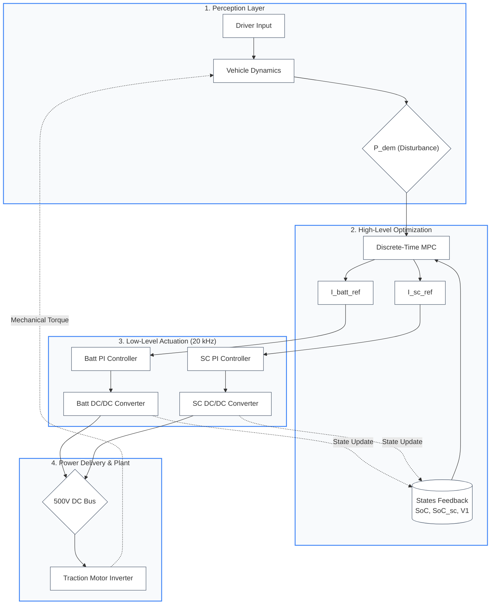

# Energy Management System Architecture

## Overview

This document presents a hierarchical control architecture for an energy management system with four layers: perception, high-level optimization, low-level actuation, and physical plant.

## System Architecture Diagram

## Architecture Layers

### Layer 1: Perception Layer
- **Driver Input**: Captures user commands and driving intentions
- **Vehicle Dynamics**: Models and processes vehicle kinematic/dynamic behavior
- **P_dem (Disturbance)**: Power demand signal derived from driving conditions

### Layer 2: High-Level Optimization
- **States Feedback**: Monitors system states including:
  - Battery State of Charge (SoC)
  - Supercapacitor State of Charge (SoC_sc)
  - Voltage (V1)
- **Discrete-Time MPC**: Model Predictive Controller that optimizes energy distribution
  - Outputs battery current reference (I_batt_ref)
  - Outputs supercapacitor current reference (I_sc_ref)

### Layer 3: Low-Level Actuation (20 kHz)
- **PI Controllers**: Regulate battery and supercapacitor currents to match references
  - Battery PI Controller → Battery DC/DC Converter
  - SC PI Controller → SC DC/DC Converter
- **High Frequency Loop**: Operates at 20 kHz for precise current control

### Layer 4: Power Delivery & Physical Plant
- **DC Bus**: Centralized 500V distribution point
- **Traction Motor Inverter**: Converts DC power to three-phase AC for motor drive
- **Mechanical Feedback**: Torque output feeds back to vehicle dynamics

## Feedback Loops

The system includes closed-loop feedback paths (shown as dashed lines):
- Mechanical torque from motor inverter → Vehicle dynamics
- State updates from converters → State feedback for MPC

## Control Flow Summary

1. **Perception** → Power demand is determined from driver input and vehicle state
2. **Optimization** → MPC decides optimal current references for battery and supercapacitor
3. **Actuation** → PI controllers execute the references through DC/DC converters
4. **Power Delivery** → Unified DC bus supplies the traction motor
5. **Feedback** → System states and mechanical outputs update perception and control layers
